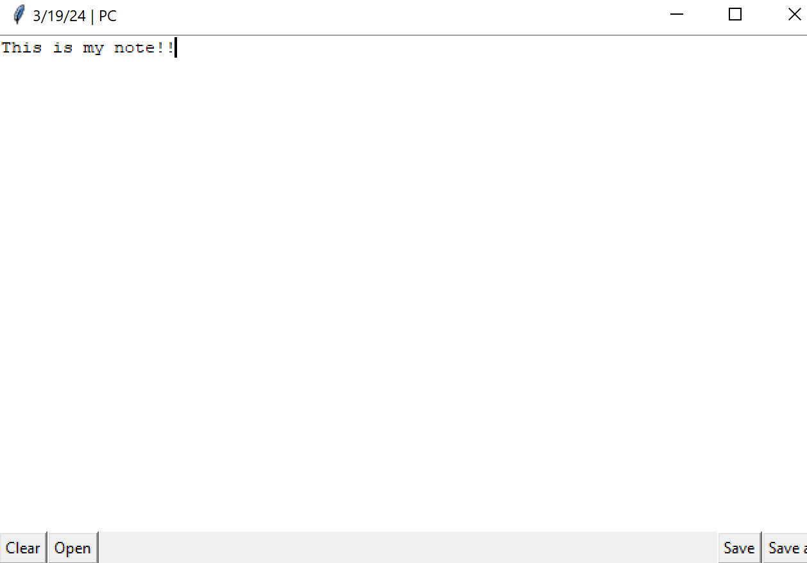
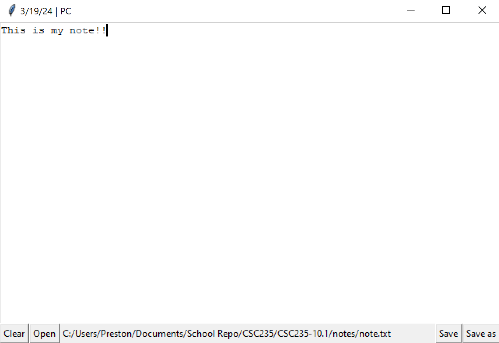

# CSC235 Assignment 10.1
Create a GUI in Python

# Features
- Write notes
- Open notes
    - When doing a save it will update the opened file
- Save note to opened file
    - If there is no opened file, save as new
- Save note as new file
- Clear note
    -   Asks to save if text is found

## Images

## Libraries
tkinter, a built in python library - Used for display, message boxes, and file dialog

os, a built in python library - Use to get the current directory